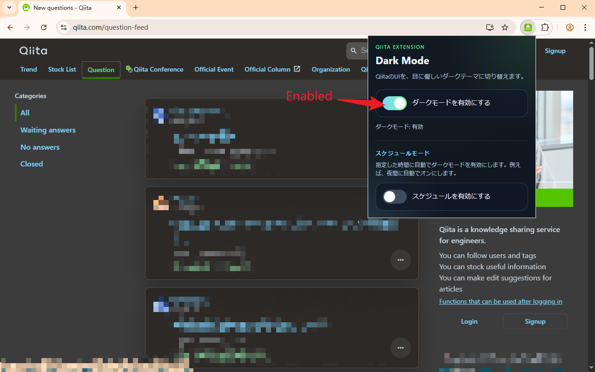
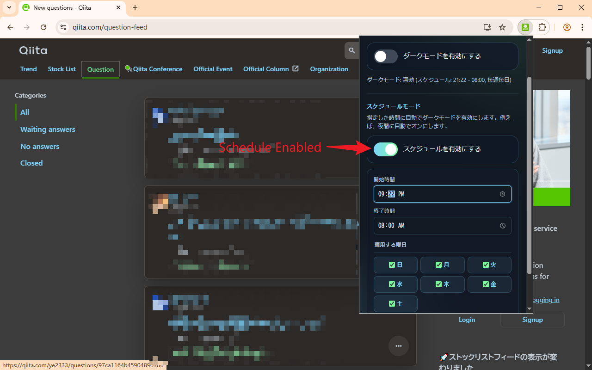

# Qiita Dark Mode

A lightweight Chrome or Edge extension that adds a dark theme to `qiita.com`.

## Features

- Deep dark palette for Qiita pages
- Popup toggle to enable or disable the theme
- Works across page navigation on `qiita.com`
- Handles dynamically inserted media nodes

## Install locally

1. Open `chrome://extensions` or `edge://extensions`.
2. Enable `Developer mode`.
3. Click `Load unpacked`.
4. Select this folder.
5. Visit `https://qiita.com`.

## Files

- `manifest.json`: extension definition
- `content.js`: applies the saved theme state to Qiita pages
- `theme.css`: dark-mode styling rules
- `popup.html`, `popup.css`, `popup.js`: extension popup UI

## Images

